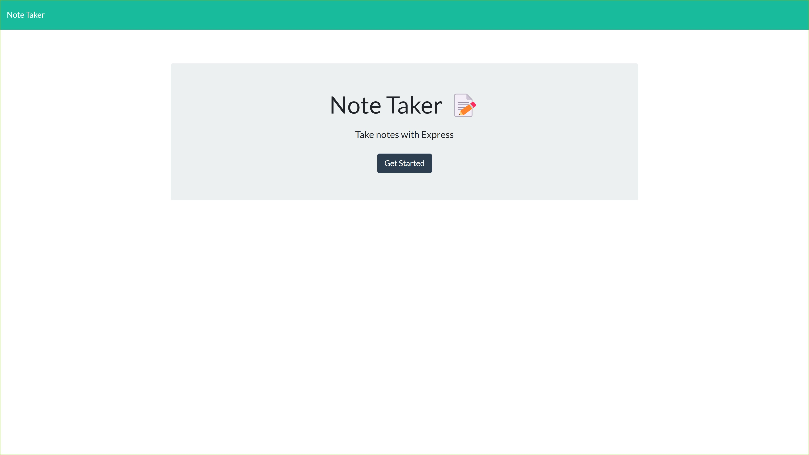
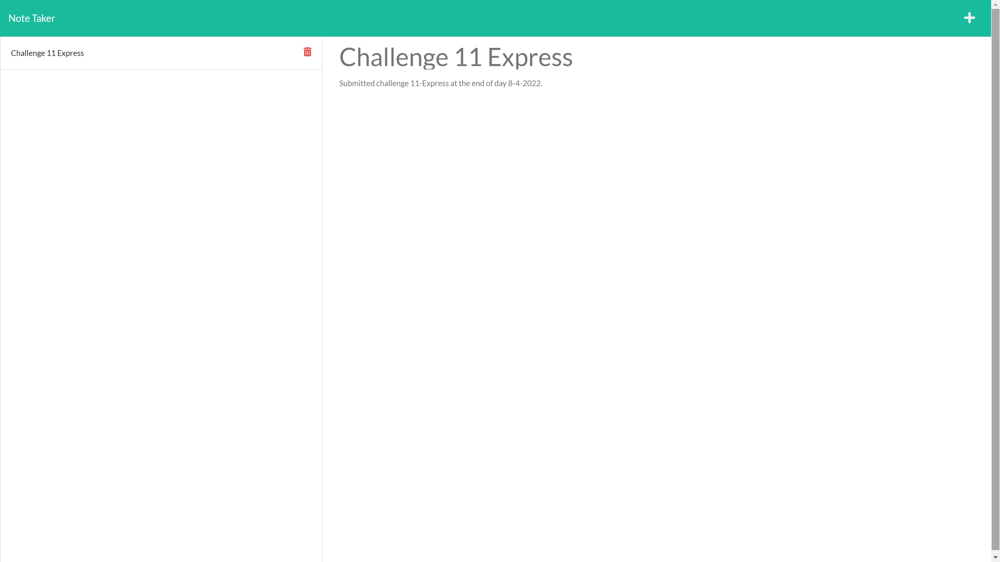

# NOTEPAD


## Description 
This project is a application that can used to write and save notes. This application uses an Express.js back end and will save and retrieve note data from a JSON file. This application will also be deployed to Heroku.
 
## Table of Contents
* [Criteria](#criteria)
* [Installation](#installation)
* [Usage](#usage)
* [License](#license)
* [Contributing](#contributing)
* [Tests](#tests)
* [Questions](#questions)

## Criteria

- GIVEN a note-taking application
- WHEN I open the Note Taker
- THEN I am presented with a landing page with a link to a notes page
- WHEN I click on the link to the notes page
- THEN I am presented with a page with existing notes listed in the left-hand column, plus empty fields to enter a new note title and the note’s text in the right-hand column
- WHEN I enter a new note title and the note’s text
- THEN a Save icon appears in the navigation at the top of the page
- WHEN I click on the Save icon
- THEN the new note I have entered is saved and appears in the left-hand column with the other existing notes
- WHEN I click on an existing note in the list in the left-hand column
- THEN that note appears in the right-hand column
- WHEN I click on the Write icon in the navigation at the top of the page
- THEN I am presented with empty fields to enter a new note title and the note’s text in the right-hand column

## Installation 
The user should clone the repository from GitHub and Run the following line of code in your terminal to install all the needed packages: 
```
npm i
```

## Usage 
Once all the packages have been installed, open terminal and run the following code in command line : 
```
node server.js
```
This will run the server where you can find the page on localhost:3001. To end your server in your terminal type: control + c

[View deployed HEROKU app here!](https://whispering-dusk-10136.herokuapp.com/)




## License 
This project is license under MIT

## Contributing 
Please refer to "Fork" or be assigned by Owner. 

## Questions
If you have any questions about this project, please contact me directly at ericdoan2008@gmail.com. You can view more of my projects at https://github.com/NguyenDoan85.